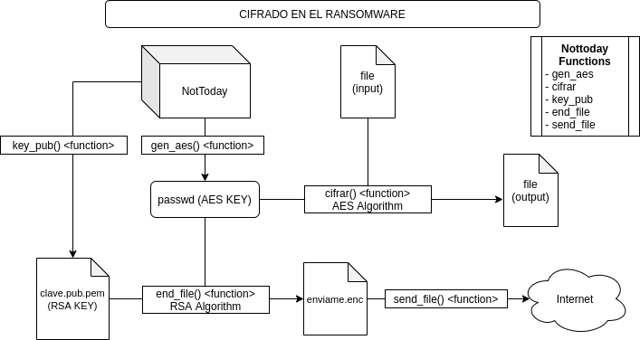

# Proyecto de Tesis 1

## Flujo de ejecución del programa

## Objetivos

- Determinar el método óptimo de búsqueda de fichero a cifrar. (Listo)
- Determinar cuál es el mejor candidato para establecer como algoritmo de cifrado.  (Listo)
- Determinar cómo se compartirá la clave parcial generada para el descifrado.  (Listo)
- Desarrollo del ransomware en C. (Listo)
- Desarrollo del demonio del ransomware. (Listo)
- Verificar que no cifre por segunda vez un fichero (Listo)
- Desarrollo de habilidades antiforenses para imposibilitar la recuperación de los archivos no cifrados. (Listo) [Posible mejora]
- Seleccion de que directorios no revisar para cifrar (Listo) [Posible Mejora]
- Desarrollo de la propiedad de rootkit del ransomware. (P)

## TO-DO
- Desarrollo del demonio del ransomware.(parcialmente desarrollado)
- Desarrollo de la propiedad de rootkit del ransomware. 
- Desarrollo de habilidades antiforenses para imposibilitar la recuperación de los archivos no cifrados.
- Extras: Bloquear Perifericos, Detener apagado del sistema
- función `cifrar()`. Analizar la posibilidad de usar pthreads.
- programa para recibir conexión/control remoto.
- intentar hacer algo para que no mate el proceso de cifrado. (nuevo)
- Manejar excepciones de conexion a internet (nuevo)
- Unidad de Prueba (/test -> ¿?)
- Mandar una señal de shutdown cuando
- Actualizar imagenes

## Generacion aleatoria de la clave AES

sdasdasdasd

## Usando RSA + AES

sasdasd

